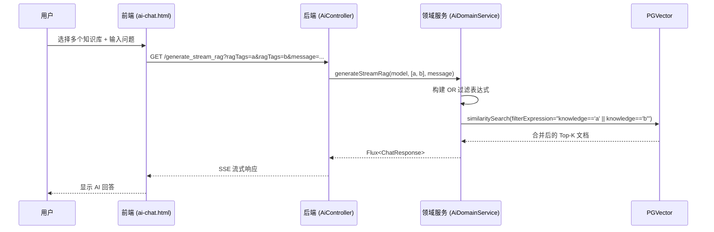

# 知识库多选功能技术规格

## 1. 背景与目标

当前系统仅支持单选知识库进行 RAG 检索。本需求旨在扩展为 **多选知识库**，允许用户同时选择多个知识库，合并检索结果以增强 AI 回答的知识覆盖面。

---

## 2. 已确认的架构决策

| 决策项 | 选定方案 |
|--------|----------|
| 多知识库检索策略 | **OR 策略**：合并多个知识库的检索结果，按相似度排序取 Top-K |
| 选择上限 | **最多 10 个** |
| 全选功能 | **需要**"全选/全不选"按钮 |
| UI 交互形式 | **标签式多选**：每个已选知识库显示为可关闭的标签 |
| 默认选择状态 | **不使用知识库**（保持现有默认行为） |

---

## 3. 现状分析

### 3.1 前端 (`ai-chat.html`)

```html
<!-- 当前实现：单选下拉框 -->
<select id="ragTagSelect" class="...">
    <option value="">不使用知识库</option>
    <!-- 动态加载的知识库选项 -->
</select>
```

**调用方式**：
```javascript
const ragTag = document.getElementById('ragTagSelect').value;
const url = ragTag 
    ? `/api/v1/ai/generate_stream_rag?ragTag=${encodeURIComponent(ragTag)}&message=...`
    : `/api/v1/ai/generate_stream?message=...`;
```

### 3.2 后端 (`AiController.java`)

```java
@GetMapping(value = "generate_stream_rag", produces = "text/event-stream")
public Flux<ChatResponse> generateStreamRag(
        @RequestParam(value = "model", required = false) String model,
        @RequestParam("ragTag") String ragTag,  // 单个 ragTag
        @RequestParam("message") String message) {
    return aiDomainService.generateStreamRag(model, ragTag, message);
}
```

### 3.3 领域服务 (`AiDomainService.java`)

```java
SearchRequest request = SearchRequest.builder()
        .query(message)
        .topK(5)
        .filterExpression("knowledge == '" + ragTag + "'")  // 单知识库过滤
        .build();
```

---

## 4. 技术方案

### 4.1 前端改造

#### 4.1.1 新增多选组件

将单选下拉框替换为 **标签式多选组件**：

```
┌─────────────────────────────────────────────────────┐
│  RAG 知识库                                          │
├─────────────────────────────────────────────────────┤
│ ┌─────────┐ ┌─────────┐ ┌─────────┐                │
│ │ 产品文档 ✕│ │ API手册 ✕│ │ FAQ库  ✕│  + 添加      │
│ └─────────┘ └─────────┘ └─────────┘                │
├─────────────────────────────────────────────────────┤
│ [全选] [全不选]          已选 3/10，上限 10 个       │
└─────────────────────────────────────────────────────┘
```

**组件行为**：
- 点击"+ 添加"按钮弹出可选知识库列表（带搜索过滤）
- 每个已选标签有删除按钮（✕）
- 达到 10 个上限时，"+ 添加"按钮禁用并提示
- "全选"按钮一次性选中所有（但不超过 10 个）
- "全不选"按钮清空所有选中

#### 4.1.2 参数传递

```javascript
// 收集所有选中的 ragTags
const selectedTags = getSelectedRagTags(); // ['产品文档', 'API手册', 'FAQ库']

if (selectedTags.length > 0) {
    // 使用数组参数：ragTags=xxx&ragTags=yyy 或 ragTags=xxx,yyy
    const ragTagsParam = selectedTags.map(t => `ragTags=${encodeURIComponent(t)}`).join('&');
    url = `/api/v1/ai/generate_stream_rag?${ragTagsParam}&message=...`;
} else {
    url = `/api/v1/ai/generate_stream?message=...`;
}
```

---

### 4.2 后端改造

#### 4.2.1 API 接口

**直接改造原接口**，使用 List 参数同时支持单个和多个知识库：

```java
/**
 * RAG 流式对话接口
 * 单个：GET /api/v1/ai/generate_stream_rag?ragTags=doc1&message=你好
 * 多个：GET /api/v1/ai/generate_stream_rag?ragTags=doc1&ragTags=doc2&message=你好
 */
@GetMapping(value = "generate_stream_rag", produces = "text/event-stream")
public Flux<ChatResponse> generateStreamRag(
        @RequestParam(value = "model", required = false) String model,
        @RequestParam(value = "ragTags", required = false) List<String> ragTags,
        @RequestParam("message") String message) {
    return aiDomainService.generateStreamRag(model, ragTags, message);
}
```

> [!NOTE]  
> 参数名从 `ragTag` 变为 `ragTags`（List），前端需同步修改。传入单个值时自动转为单元素 List。

#### 4.2.2 领域服务

```java
/**
 * RAG 流式对话（支持多知识库）
 */
public Flux<ChatResponse> generateStreamRag(String model, List<String> ragTags, String message) {
    // 构建 OR 过滤表达式
    // 例如：knowledge == 'doc1' || knowledge == 'doc2' || knowledge == 'doc3'
    String filterExpression = ragTags.stream()
            .map(tag -> "knowledge == '" + tag + "'")
            .collect(Collectors.joining(" || "));

    SearchRequest request = SearchRequest.builder()
            .query(message)
            .topK(5)
            .filterExpression(filterExpression)
            .build();

    List<Document> documents = pgVectorStore.similaritySearch(request);
    // ... 后续逻辑不变
}
```

> [!IMPORTANT]  
> 使用 PGVector 的 `||` (OR) 语法合并多个知识库的过滤条件。检索结果按相似度排序，取 Top-K。

---

## 5. 数据流图



---

## 6. 边界与约束

| 约束项 | 说明 |
|--------|------|
| 最大选择数 | 10 个知识库 |
| 空选择处理 | 等同于"不使用知识库"，走普通对话接口 |
| Top-K 设置 | 合并检索后仍取 Top-K (默认 5)，不会因多选而翻倍 |

---

## 7. 验收标准

- [ ] 前端支持标签式多选，最多选择 10 个知识库
- [ ] "全选/全不选"按钮功能正常
- [ ] 默认状态为"不使用知识库"
- [ ] 后端支持 `ragTags` 数组参数
- [ ] 多知识库检索使用 OR 策略，结果按相似度排序
- [ ] 选中超过 10 个时，前端禁止继续选择并提示
