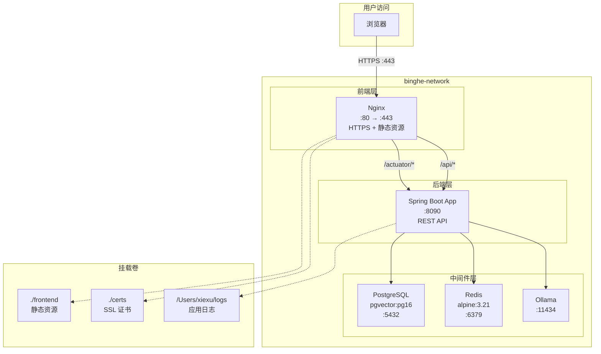

# AI-RAG-Knowledge Docker 本地部署技术实现方案

> **文档版本**: v1.0  
> **创建日期**: 2026-01-10  
> **基于规格**: [spec.md](file:///Users/xiexu/xiaofu/ai-rag-knowledge-study/.claude/docker-deploy/spec.md) v1.4  
> **作者**: 高级架构师

---

## 1. 方案概述

### 1.1 目标

基于 [spec.md](file:///Users/xiexu/xiaofu/ai-rag-knowledge-study/.claude/docker-deploy/spec.md) 需求规格，实现 `ai-rag-knowledge-study` 项目的本地 Docker 部署，主要目标包括：

- ✅ 前后端完全分离部署架构
- ✅ Nginx 反向代理 + HTTPS 支持
- ✅ 项目内静态资源管理
- ✅ 复用现有 `binghe-network` 中间件环境
- ✅ 完整的健康检查和日志管理

### 1.2 技术架构总览



---

## 2. 实施阶段划分

整个实施过程分为 **6 个阶段**，按依赖关系顺序执行：

| 阶段 | 名称 | 主要任务 | 预估时间 |
|------|------|----------|----------|
| Phase 0 | 代码前置修改 | 添加 Actuator 依赖 | 2 min |
| Phase 1 | 环境准备 | 目录创建、数据库初始化、SSL 证书生成 | 10 min |
| Phase 2 | 配置文件创建 | Dockerfile、docker-compose.yml、Nginx 配置 | 15 min |
| Phase 3 | 前端资源准备 | 复制静态文件到 frontend/ 目录 | 5 min |
| Phase 4 | 镜像构建与部署 | Maven 打包、Docker 镜像构建、服务启动 | 15 min |
| Phase 5 | 验证与测试 | 健康检查、功能测试、连通性验证 | 10 min |

---

## 3. Phase 0: 代码前置修改

> [!IMPORTANT]
> 此阶段为必要前置步骤，健康检查功能依赖 Spring Boot Actuator。

### 3.1 添加 Actuator 依赖

#### [MODIFY] [pom.xml](file:///Users/xiexu/xiaofu/ai-rag-knowledge-study/xfg-dev-tech-app/pom.xml)

**原因**：Docker 容器健康检查需要访问 `/actuator/health` 端点，当前项目缺少此依赖。

在 `<dependencies>` 节点内添加以下依赖：

```xml
<!-- Spring Boot Actuator - 用于健康检查 -->
<dependency>
    <groupId>org.springframework.boot</groupId>
    <artifactId>spring-boot-starter-actuator</artifactId>
</dependency>
```

**建议添加位置**：在 `spring-boot-starter-test` 依赖之后（约第 33 行）

**完整 diff**：

```diff
         <dependency>
             <groupId>org.springframework.boot</groupId>
             <artifactId>spring-boot-starter-test</artifactId>
             <scope>test</scope>
         </dependency>
+
+        <!-- Spring Boot Actuator - 用于健康检查和监控 -->
+        <dependency>
+            <groupId>org.springframework.boot</groupId>
+            <artifactId>spring-boot-starter-actuator</artifactId>
+        </dependency>

         <dependency>
             <groupId>org.springframework.ai</groupId>
```

### 3.2 配置 Actuator 端点 (可选)

如需更细粒度的控制，可在 `application-dev.yml` 中添加以下配置：

```yaml
management:
  endpoints:
    web:
      exposure:
        include: health,info,metrics
  endpoint:
    health:
      show-details: always
```

> [!NOTE]
> 默认情况下 `/actuator/health` 端点已启用，上述配置为可选的增强配置。

---

## 4. Phase 1: 环境准备

### 4.1 创建目录结构

```bash
# 创建部署相关目录
mkdir -p /Users/xiexu/xiaofu/ai-rag-knowledge-study/.claude/docker-deploy/{frontend,certs,nginx/conf.d,scripts}

# 创建日志目录
mkdir -p /Users/xiexu/logs
chmod 755 /Users/xiexu/logs
```

### 4.2 数据库初始化

> [!IMPORTANT]
> 此步骤仅在首次部署时执行，后续部署可跳过。

```bash
# 创建 ai-rag-knowledge 数据库
docker exec vector_db psql -U postgres -c "CREATE DATABASE \"ai-rag-knowledge\";"

# 启用 pgvector 扩展
docker exec vector_db psql -U postgres -d ai-rag-knowledge -c "CREATE EXTENSION IF NOT EXISTS vector;"

# 验证数据库创建成功
docker exec vector_db psql -U postgres -c "\l" | grep ai-rag-knowledge
```

### 4.3 生成 SSL 自签名证书

```bash
cd /Users/xiexu/xiaofu/ai-rag-knowledge-study/.claude/docker-deploy

# 生成自签名证书 (有效期 365 天)
openssl req -x509 -nodes -days 365 -newkey rsa:2048 \
    -keyout certs/localhost.key \
    -out certs/localhost.crt \
    -subj "/CN=localhost/O=Development/C=CN" \
    -addext "subjectAltName=DNS:localhost,IP:127.0.0.1"

# 验证证书
openssl x509 -in certs/localhost.crt -text -noout | head -20
```

---

## 5. Phase 2: 配置文件创建

### 5.1 文件清单

| 文件 | 路径 | 用途 |
|------|------|------|
| Dockerfile | `.claude/docker-deploy/Dockerfile` | 应用镜像构建 |
| docker-compose.yml | `.claude/docker-deploy/docker-compose.yml` | 服务编排 |
| .env | `.claude/docker-deploy/.env` | 环境变量 |
| nginx.conf | `.claude/docker-deploy/nginx/nginx.conf` | Nginx 主配置 |
| default.conf | `.claude/docker-deploy/nginx/conf.d/default.conf` | 虚拟主机配置 |

### 5.2 Dockerfile 实现

#### [NEW] [Dockerfile](file:///Users/xiexu/xiaofu/ai-rag-knowledge-study/.claude/docker-deploy/Dockerfile)

**设计要点**：
- 基础镜像: `openjdk:17-jdk-slim` (与项目 Java 版本一致)
- 时区配置: PRC (中国标准时间)
- JVM 参数: `-Xms512m -Xmx512m` (可通过环境变量覆盖)
- 默认 Profile: `dev`

```dockerfile
# 基础镜像
FROM openjdk:17-jdk-slim

# 维护者信息
LABEL maintainer="xiexu"

# 环境变量
ENV PARAMS=""
ENV JAVA_OPTS="-Xms512m -Xmx512m"
ENV TZ=PRC

# 时区配置
RUN ln -snf /usr/share/zoneinfo/$TZ /etc/localtime && echo $TZ > /etc/timezone

# 工作目录
WORKDIR /app

# 添加应用 JAR
COPY target/ai-rag-knowledge-app.jar /app/ai-rag-knowledge-app.jar

# 暴露端口
EXPOSE 8090

# 启动命令
ENTRYPOINT ["sh", "-c", "java $JAVA_OPTS -jar /app/ai-rag-knowledge-app.jar --spring.profiles.active=dev $PARAMS"]
```

### 5.3 docker-compose.yml 实现

#### [NEW] [docker-compose.yml](file:///Users/xiexu/xiaofu/ai-rag-knowledge-study/.claude/docker-deploy/docker-compose.yml)

**设计要点**：
- 使用外部网络 `binghe-network` (复用现有中间件)
- Nginx 服务监听 80/443 端口
- 应用服务使用容器名称访问中间件
- 配置健康检查和日志轮转

```yaml
version: '3.8'

services:
  # Nginx 前端服务 (HTTPS)
  nginx:
    image: nginx:1.25.1
    container_name: nginx
    restart: always
    ports:
      - "80:80"
      - "443:443"
    volumes:
      - ./frontend:/usr/share/nginx/html
      - ./nginx/nginx.conf:/etc/nginx/nginx.conf
      - ./nginx/conf.d:/etc/nginx/conf.d
      - ./certs:/etc/nginx/certs
    depends_on:
      - ai-rag-knowledge-app
    networks:
      - binghe-network
    healthcheck:
      test: ["CMD", "curl", "-kf", "https://localhost/"]
      interval: 30s
      timeout: 10s
      retries: 3

  # Spring Boot 后端服务
  ai-rag-knowledge-app:
    build:
      context: ../../xfg-dev-tech-app
      dockerfile: ../.claude/docker-deploy/Dockerfile
    image: ai-rag-knowledge-app:${APP_VERSION:-1.0}
    container_name: ai-rag-knowledge-app
    restart: on-failure
    ports:
      - "${APP_PORT:-8090}:8090"
    environment:
      - TZ=PRC
      - JAVA_OPTS=-Xms512m -Xmx512m
      - SERVER_PORT=8090
      - SPRING_PROFILES_ACTIVE=dev
      - SPRING_DATASOURCE_URL=${DB_URL:-jdbc:postgresql://vector_db:5432/ai-rag-knowledge}
      - SPRING_DATASOURCE_USERNAME=${DB_USER:-postgres}
      - SPRING_DATASOURCE_PASSWORD=${DB_PASSWORD:-postgres}
      - SPRING_DATASOURCE_DRIVER_CLASS_NAME=org.postgresql.Driver
      - SPRING_AI_OLLAMA_BASE_URL=${OLLAMA_URL:-http://ollama:11434}
      - REDIS_SDK_CONFIG_HOST=${REDIS_HOST:-redis}
      - REDIS_SDK_CONFIG_PORT=${REDIS_PORT:-6379}
    volumes:
      - /Users/xiexu/logs:/data/log
    logging:
      driver: "json-file"
      options:
        max-size: "10m"
        max-file: "3"
    healthcheck:
      test: ["CMD", "curl", "-f", "http://localhost:8090/actuator/health"]
      interval: 30s
      timeout: 10s
      retries: 3
      start_period: 60s
    networks:
      - binghe-network

networks:
  binghe-network:
    external: true
```

### 5.4 环境变量配置

#### [NEW] [.env](file:///Users/xiexu/xiaofu/ai-rag-knowledge-study/.claude/docker-deploy/.env)

```properties
# 应用配置
APP_VERSION=1.0
APP_PORT=8090

# JVM 配置
JAVA_OPTS=-Xms512m -Xmx512m

# Spring 配置
SPRING_PROFILE=dev

# PostgreSQL 配置
DB_URL=jdbc:postgresql://vector_db:5432/ai-rag-knowledge
DB_USER=postgres
DB_PASSWORD=postgres

# Ollama 配置
OLLAMA_URL=http://ollama:11434

# Redis 配置
REDIS_HOST=redis
REDIS_PORT=6379

# 日志配置
LOG_PATH=/Users/xiexu/logs
```

### 5.5 Nginx 配置实现

#### [NEW] [nginx.conf](file:///Users/xiexu/xiaofu/ai-rag-knowledge-study/.claude/docker-deploy/nginx/nginx.conf)

```nginx
user  nginx;
worker_processes  auto;

error_log  /var/log/nginx/error.log notice;
pid        /var/run/nginx.pid;

events {
    worker_connections  1024;
}

http {
    include       /etc/nginx/mime.types;
    default_type  application/octet-stream;

    log_format  main  '$remote_addr - $remote_user [$time_local] "$request" '
                      '$status $body_bytes_sent "$http_referer" '
                      '"$http_user_agent" "$http_x_forwarded_for"';

    access_log  /var/log/nginx/access.log  main;

    sendfile        on;
    keepalive_timeout  65;

    # Gzip 压缩
    gzip  on;
    gzip_vary on;
    gzip_min_length 1024;
    gzip_proxied any;
    gzip_types text/plain text/css text/xml text/javascript 
               application/x-javascript application/xml 
               application/javascript application/json;

    include /etc/nginx/conf.d/*.conf;
}
```

#### [NEW] [default.conf](file:///Users/xiexu/xiaofu/ai-rag-knowledge-study/.claude/docker-deploy/nginx/conf.d/default.conf)

**核心功能**：
- HTTP 自动重定向到 HTTPS
- 静态资源服务 + 缓存控制
- API 反向代理 (`/api/*`)
- Actuator 代理 (`/actuator/*`)
- SSE 流式响应支持

```nginx
# HTTP 重定向到 HTTPS
server {
    listen       80;
    server_name  localhost;
    
    location /health {
        return 200 'OK';
        add_header Content-Type text/plain;
    }
    
    location / {
        return 301 https://$host$request_uri;
    }
}

# HTTPS 服务
server {
    listen       443 ssl;
    server_name  localhost;

    # SSL 配置
    ssl_certificate     /etc/nginx/certs/localhost.crt;
    ssl_certificate_key /etc/nginx/certs/localhost.key;
    ssl_protocols       TLSv1.2 TLSv1.3;
    ssl_ciphers         HIGH:!aNULL:!MD5;
    ssl_prefer_server_ciphers on;

    # 前端静态资源
    location / {
        root   /usr/share/nginx/html;
        index  index.html index.htm;
        try_files $uri $uri/ /index.html;
    }

    # API 反向代理
    location /api/ {
        proxy_pass http://ai-rag-knowledge-app:8090/api/;
        proxy_set_header Host $host;
        proxy_set_header X-Real-IP $remote_addr;
        proxy_set_header X-Forwarded-For $proxy_add_x_forwarded_for;
        proxy_set_header X-Forwarded-Proto $scheme;
        
        # SSE 支持
        proxy_buffering off;
        proxy_cache off;
        proxy_read_timeout 300s;
        proxy_connect_timeout 75s;
    }

    # Actuator 健康检查代理
    location /actuator/ {
        proxy_pass http://ai-rag-knowledge-app:8090/actuator/;
        proxy_set_header Host $host;
        proxy_set_header X-Real-IP $remote_addr;
        proxy_set_header X-Forwarded-For $proxy_add_x_forwarded_for;
        proxy_set_header X-Forwarded-Proto $scheme;
    }

    # 静态资源缓存
    location ~* \.(js|css|png|jpg|jpeg|gif|ico|svg|woff|woff2|ttf|eot)$ {
        root   /usr/share/nginx/html;
        expires 7d;
        add_header Cache-Control "public, immutable";
    }

    error_page   500 502 503 504  /50x.html;
    location = /50x.html {
        root   /usr/share/nginx/html;
    }
}
```

---

## 6. Phase 3: 前端资源准备

### 6.1 静态资源复制

将 Spring Boot 项目中的静态资源复制到 `frontend/` 目录：

```bash
cd /Users/xiexu/xiaofu/ai-rag-knowledge-study/.claude/docker-deploy

# 复制所有静态资源
cp -r ../../xfg-dev-tech-app/src/main/resources/static/* frontend/

# 验证文件
ls -la frontend/
```

### 6.2 预期文件结构

```
frontend/
├── index.html          # 主页 (可选)
├── ai-chat.html        # AI 聊天页面
├── model-config.html   # 模型配置页面
├── knowledge.html      # 知识库页面
├── upload.html         # 文件上传页面
├── css/                # 样式文件
└── js/                 # JavaScript 文件
```

---

## 7. Phase 4: 镜像构建与部署

### 7.1 构建应用 JAR

```bash
cd /Users/xiexu/xiaofu/ai-rag-knowledge-study

# Maven 打包 (跳过测试)
mvn clean package -DskipTests

# 验证 JAR 文件
ls -lh xfg-dev-tech-app/target/ai-rag-knowledge-app.jar
```

### 7.2 构建 Docker 镜像

```bash
cd /Users/xiexu/xiaofu/ai-rag-knowledge-study

# 构建应用镜像
docker build -t ai-rag-knowledge-app:1.0 \
    -f .claude/docker-deploy/Dockerfile \
    xfg-dev-tech-app/

# 验证镜像
docker images | grep ai-rag-knowledge-app
```

### 7.3 启动服务

```bash
cd /Users/xiexu/xiaofu/ai-rag-knowledge-study/.claude/docker-deploy

# 启动所有服务
docker-compose up -d

# 查看服务状态
docker-compose ps

# 查看启动日志
docker-compose logs -f
```

---

## 8. Phase 5: 验证与测试

### 8.1 容器健康检查

```bash
# 检查容器状态
docker ps --format "table {{.Names}}\t{{.Status}}\t{{.Ports}}"

# 预期输出:
# nginx          Up (healthy)   0.0.0.0:80->80/tcp, 0.0.0.0:443->443/tcp
# ai-rag-knowledge-app   Up (healthy)   0.0.0.0:8090->8090/tcp
```

### 8.2 服务连通性测试

| 测试项 | 命令 | 预期结果 |
|--------|------|----------|
| HTTPS 访问 | `curl -k https://localhost/` | 返回 HTML 页面 |
| HTTP 重定向 | `curl -I http://localhost/` | 返回 301 重定向 |
| API 代理 | `curl -k https://localhost/api/` | API 响应 |
| Actuator 代理 | `curl -k https://localhost/actuator/health` | `{"status":"UP"}` |
| 后端直连 | `curl http://localhost:8090/actuator/health` | `{"status":"UP"}` |

```bash
# 执行测试脚本
echo "=== HTTPS 访问测试 ==="
curl -k -s https://localhost/ | head -5

echo "=== HTTP 重定向测试 ==="
curl -sI http://localhost/ | grep -E "HTTP|Location"

echo "=== 健康检查测试 ==="
curl -k -s https://localhost/actuator/health | jq .

echo "=== 后端直连测试 ==="
curl -s http://localhost:8090/actuator/health | jq .
```

### 8.3 中间件连通性验证

```bash
# 从应用容器内测试中间件连接
docker exec ai-rag-knowledge-app ping -c 1 vector_db
docker exec ai-rag-knowledge-app ping -c 1 redis
docker exec ai-rag-knowledge-app ping -c 1 ollama
```

---

## 9. 脚本工具

### 9.1 一键部署脚本

#### [NEW] [deploy.sh](file:///Users/xiexu/xiaofu/ai-rag-knowledge-study/.claude/docker-deploy/scripts/deploy.sh)

```bash
#!/bin/bash
set -e

SCRIPT_DIR="$(cd "$(dirname "${BASH_SOURCE[0]}")" && pwd)"
PROJECT_ROOT="$(cd "$SCRIPT_DIR/../../../" && pwd)"
DEPLOY_DIR="$SCRIPT_DIR/.."

echo "🚀 AI-RAG-Knowledge Docker 部署脚本"
echo "======================================"

# 1. 检查前置条件
echo "📋 检查前置条件..."
if ! docker info > /dev/null 2>&1; then
    echo "❌ Docker 未运行"
    exit 1
fi

# 2. 复制前端资源
echo "📦 复制前端静态资源..."
mkdir -p "$DEPLOY_DIR/frontend"
cp -r "$PROJECT_ROOT/xfg-dev-tech-app/src/main/resources/static/"* "$DEPLOY_DIR/frontend/"

# 3. 检查 SSL 证书
if [ ! -f "$DEPLOY_DIR/certs/localhost.crt" ]; then
    echo "🔐 生成 SSL 证书..."
    mkdir -p "$DEPLOY_DIR/certs"
    openssl req -x509 -nodes -days 365 -newkey rsa:2048 \
        -keyout "$DEPLOY_DIR/certs/localhost.key" \
        -out "$DEPLOY_DIR/certs/localhost.crt" \
        -subj "/CN=localhost/O=Development/C=CN" \
        -addext "subjectAltName=DNS:localhost,IP:127.0.0.1"
fi

# 4. 构建应用
echo "🔨 构建 Spring Boot 应用..."
cd "$PROJECT_ROOT"
mvn clean package -DskipTests -q

# 5. 构建 Docker 镜像
echo "🐳 构建 Docker 镜像..."
docker build -t ai-rag-knowledge-app:1.0 \
    -f "$DEPLOY_DIR/Dockerfile" \
    "$PROJECT_ROOT/xfg-dev-tech-app/"

# 6. 启动服务
echo "🚀 启动服务..."
cd "$DEPLOY_DIR"
docker-compose up -d

# 7. 等待服务就绪
echo "⏳ 等待服务启动..."
sleep 10

# 8. 健康检查
echo "✅ 健康检查..."
if curl -k -s https://localhost/actuator/health | grep -q "UP"; then
    echo "🎉 部署成功！"
    echo ""
    echo "访问地址:"
    echo "  - HTTPS: https://localhost"
    echo "  - 后端直连: http://localhost:8090"
else
    echo "⚠️  服务可能未完全启动，请检查日志: docker-compose logs"
fi
```

### 9.2 初始化数据库脚本

#### [NEW] [init-db.sh](file:///Users/xiexu/xiaofu/ai-rag-knowledge-study/.claude/docker-deploy/scripts/init-db.sh)

```bash
#!/bin/bash
set -e

echo "🗄️  初始化数据库..."

# 检查 vector_db 容器
if ! docker ps | grep -q vector_db; then
    echo "❌ vector_db 容器未运行"
    exit 1
fi

# 创建数据库
docker exec vector_db psql -U postgres -c "CREATE DATABASE \"ai-rag-knowledge\";" 2>/dev/null || \
    echo "ℹ️  数据库已存在"

# 启用 pgvector 扩展
docker exec vector_db psql -U postgres -d ai-rag-knowledge \
    -c "CREATE EXTENSION IF NOT EXISTS vector;"

echo "✅ 数据库初始化完成"
```

---

## 10. 验收检查清单

### 10.1 功能验收

- [ ] Nginx 容器正常运行
- [ ] 应用容器正常运行
- [ ] HTTPS 访问正常 (https://localhost)
- [ ] HTTP 自动重定向到 HTTPS
- [ ] 静态页面正常显示
- [ ] API 请求正常代理
- [ ] Actuator 健康检查正常
- [ ] SSE 流式响应正常 (AI 聊天)

### 10.2 中间件连接验收

- [ ] PostgreSQL 连接正常
- [ ] Redis 连接正常
- [ ] Ollama 连接正常

### 10.3 运维验收

- [ ] 容器健康检查显示 healthy
- [ ] 日志文件正常输出到 /Users/xiexu/logs
- [ ] 容器异常退出后自动重启

---

## 11. 风险与回滚

### 11.1 潜在风险

| 风险 | 影响 | 缓解措施 |
|------|------|----------|
| 端口冲突 | 服务无法启动 | 预先检查 80/443/8090 端口占用 |
| SSL 证书错误 | HTTPS 无法访问 | 重新生成证书 |
| 中间件未运行 | 应用启动失败 | 部署前检查中间件状态 |
| 网络不通 | 服务间无法通信 | 确保所有容器在 binghe-network |

### 11.2 回滚步骤

```bash
# 停止并删除容器
docker-compose down

# 删除构建的镜像 (可选)
docker rmi ai-rag-knowledge-app:1.0

# 清理资源
rm -rf frontend/* certs/*
```

---

## 12. 后续优化建议

| 优化项 | 描述 | 优先级 |
|--------|------|--------|
| CI/CD 集成 | GitHub Actions 自动构建部署 | 高 |
| 正式 SSL 证书 | 使用 Let's Encrypt 或企业证书 | 中 |
| 资源限制 | 配置容器 CPU/内存限制 | 中 |
| 监控告警 | 集成 Prometheus + Grafana | 低 |
| 日志聚合 | 集成 ELK Stack | 低 |

---

> **文档结束**
