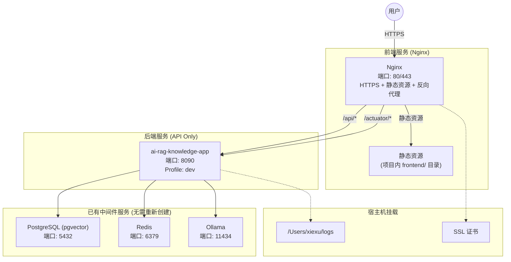
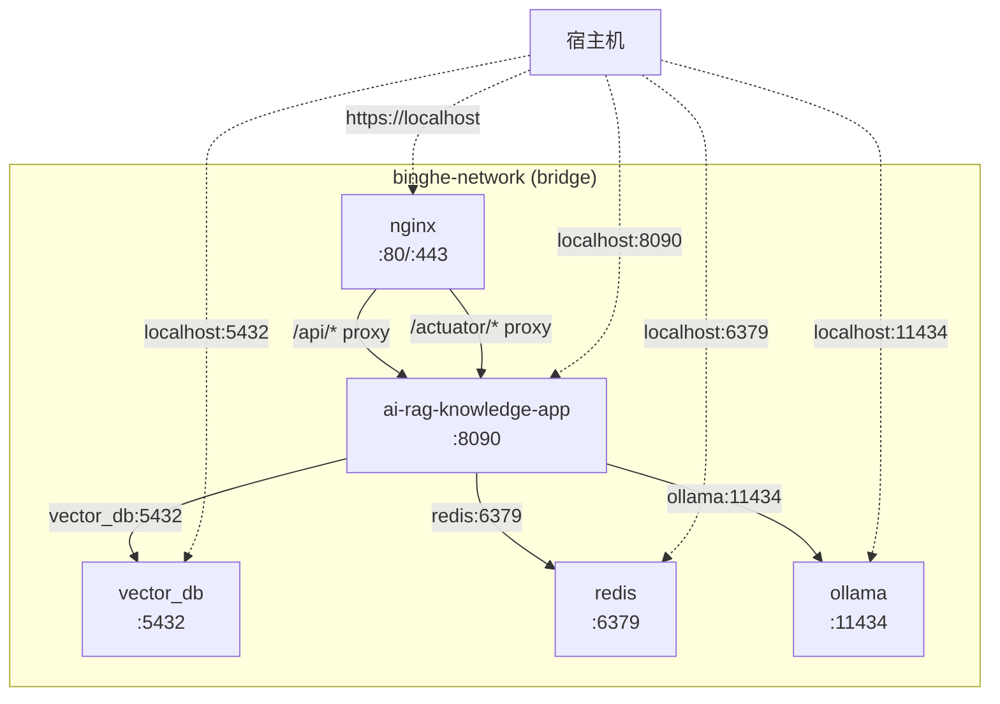
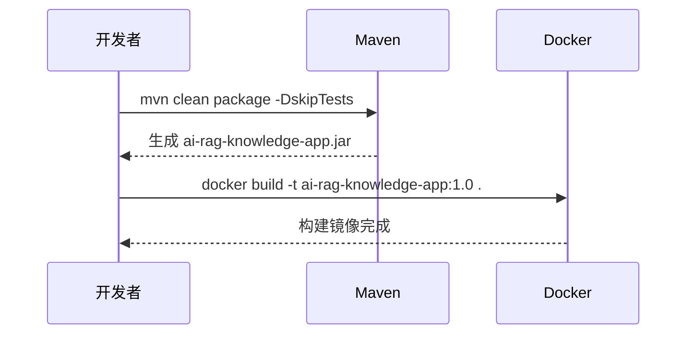
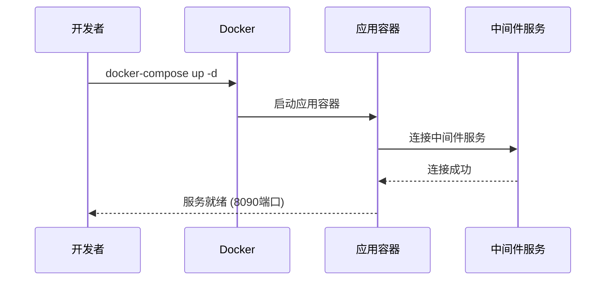

# AI-RAG-Knowledge 项目 Docker 本地部署需求规格说明书

> **文档版本**: v1.4  
> **创建日期**: 2026-01-10  
> **最后更新**: 2026-01-10  
> **作者**: 架构设计文档

---

## 1. 概述

### 1.1 文档目的

本文档旨在详细描述 `ai-rag-knowledge-study` 项目在本地 Docker 环境中的部署需求和规范，基于对现有参考文件的分析和本机现有环境的评估，设计适合本地开发和测试的部署方案。

### 1.2 项目背景

`ai-rag-knowledge-study` 是一个基于 Spring Boot 3.2.3 和 Spring AI 1.0.0-M6 构建的 RAG (检索增强生成) 知识库应用。项目需要依赖 PostgreSQL (pgvector)、Redis 和 Ollama 等中间件服务。

### 1.3 参考文件分析

| 参考文件 | 说明 |
|---------|------|
| [Dockerfile-别人的](file:///Users/xiexu/xiaofu/ai-rag-knowledge-study/xfg-dev-tech-app/Dockerfile-别人的) | 应用镜像构建文件 |
| [docker-compose-app-v1.0-别人的.yml](file:///Users/xiexu/xiaofu/ai-rag-knowledge-study/docs/dev-ops/docker-compose-app-v1.0-别人的.yml) | 应用服务编排配置 |
| [docker-compose-environment-别人的.yml](file:///Users/xiexu/xiaofu/ai-rag-knowledge-study/docs/dev-ops/docker-compose-environment-别人的.yml) | 中间件环境编排配置 |

---

## 2. 本机环境现状

### 2.1 Docker 运行状态

本机 Docker 已安装并正常运行，以下是关键服务的当前状态：

| 服务名称 | 镜像 | 状态 | 端口映射 |
|---------|------|------|----------|
| `ai-rag-knowledge-app` | ai-rag-knowledge-app:1.0 | ✅ 运行中 | 8090:8090 |
| `vector_db` | pgvector/pgvector:pg16 | ✅ 运行中 | 5432:5432 |
| `ollama` | ollama/ollama:0.5.10 | ✅ 运行中 | 11434:11434 |
| `redis` | redis:alpine3.21 | ✅ 运行中 | 6379:6379 |

### 2.2 Docker 网络

| 网络名称 | 驱动 | 说明 | 已连接容器 |
|---------|------|------|------------|
| `binghe-network` | bridge | **复用此网络** | redis, vector_db, ollama, ai-rag-knowledge-app |
| `bridge` | bridge | 默认桥接网络 | - |

### 2.3 Docker 镜像

关键可用镜像：

| 仓库 | 标签 | 大小 |
|------|------|------|
| ai-rag-knowledge-app | 1.0 | 442MB |
| pgvector/pgvector | pg16 | 531MB |
| ollama/ollama | 0.5.10 | 4.72GB |
| redis | alpine3.21 | 41.7MB |

> [!NOTE]
> 本机环境已经具备运行应用所需的所有中间件服务，且均处于运行状态。所有服务已连接到 `binghe-network` 网络，可直接通过容器名称互相访问。

---

## 3. 部署需求分析

### 3.1 与参考配置的差异对比

| 配置项 | 参考配置 | 本机现状 | 最终决策 |
|--------|----------|----------|----------|
| **pgvector 镜像** | v0.5.0 | pg16 | ✅ 使用本机版本 (pg16)，功能兼容 |
| **Redis 镜像** | redis:6.2 | redis:alpine3.21 | ✅ 使用本机版本，性能更优 |
| **Redis 端口** | 16379:6379 | 6379:6379 | ✅ 使用本机端口映射 |
| **PostgreSQL 数据库名** | ai-rag-knowledge | springai | ✅ **新建 `ai-rag-knowledge` 数据库** |
| **Nginx** | 需要部署 | 未部署 | ✅ **需要 (前后端完全分离 + HTTPS)** |
| **Redis Admin** | 需要部署 | 未部署 | ❌ 不需要 |
| **Docker 网络** | my-network | binghe-network | ✅ **复用 `binghe-network`** |
| **服务访问方式** | 容器名称 | - | ✅ **使用容器名称访问** |
| **Spring Profile** | - | dev | ✅ **使用 `dev` 环境** |
| **JVM 参数** | - | - | ✅ **`-Xms512m -Xmx512m`** |
| **日志挂载** | - | - | ✅ **挂载到 `/Users/xiexu/logs`** |
| **健康检查** | - | - | ✅ **启用 (Actuator)** |

### 3.2 部署模式选择

基于本机已有完整的中间件环境，采用**前后端完全分离**的部署策略：



> [!NOTE]
> 前后端完全分离架构优势：
> - **HTTPS 支持**：本地开发也能测试安全特性
> - **独立部署**：前端更新无需重启后端服务
> - **性能优化**：Nginx 处理静态资源、Gzip 压缩
> - **生产一致性**：本地环境与生产架构保持一致
> - **负载均衡**：便于未来水平扩展

---

## 4. 详细需求规格

### 4.1 Dockerfile 需求

#### 4.1.1 基础要求

| 需求项 | 描述 |
|--------|------|
| **基础镜像** | `openjdk:17-jdk-slim` |
| **时区配置** | PRC (中国标准时间) |
| **JAR 包名称** | ai-rag-knowledge-app.jar |
| **启动方式** | `java -jar` 命令启动 |
| **JVM 参数** | `-Xms512m -Xmx512m` |
| **Spring Profile** | `dev` |
| **环境变量支持** | 支持 `JAVA_OPTS` 和 `PARAMS` 环境变量 |

#### 4.1.2 构建上下文

```
xfg-dev-tech-app/
├── Dockerfile                # 新建的 Dockerfile
├── target/
│   └── ai-rag-knowledge-app.jar  # Maven 构建产物
└── ...
```

### 4.2 Docker Compose 配置需求

#### 4.2.1 应用服务配置 (docker-compose-app.yml)

| 配置项 | 值 | 说明 |
|--------|-----|------|
| **服务名** | ai-rag-knowledge-app | 应用容器名称 |
| **端口映射** | 8090:8090 | HTTP 服务端口 |
| **重启策略** | on-failure | 失败时自动重启 |
| **日志配置** | json-file, 10m, 3 files | 日志轮转配置 |
| **日志挂载** | /Users/xiexu/logs:/data/log | 宿主机日志目录 |
| **健康检查** | /actuator/health | Spring Boot Actuator |

#### 4.2.2 环境变量配置

应用需要以下环境变量来连接中间件服务：

| 环境变量 | 本地开发值 | 说明 |
|----------|------------|------|
| `SERVER_PORT` | 8090 | 服务端口 |
| `SPRING_DATASOURCE_URL` | jdbc:postgresql://vector_db:5432/ai-rag-knowledge | PostgreSQL 连接 (使用容器名和新数据库) |
| `SPRING_DATASOURCE_USERNAME` | postgres | 数据库用户名 |
| `SPRING_DATASOURCE_PASSWORD` | postgres | 数据库密码 |
| `SPRING_AI_OLLAMA_BASE_URL` | http://ollama:11434 | Ollama 服务地址 (使用容器名) |
| `REDIS_SDK_CONFIG_HOST` | redis | Redis 主机 (使用容器名) |
| `REDIS_SDK_CONFIG_PORT` | 6379 | Redis 端口 |

> [!IMPORTANT]
> 由于所有服务都在 `binghe-network` 网络中，容器间可以直接通过容器名称访问，无需使用 `host.docker.internal`。

#### 4.2.3 中间件服务配置 (docker-compose-environment.yml)

由于本机已有运行中的中间件服务，**中间件编排文件为可选**。但为完整性和可移植性考虑，仍建议提供。

| 服务 | 镜像 | 端口 | 健康检查 |
|------|------|------|----------|
| `vector_db` | pgvector/pgvector:pg16 | 5432:5432 | `pg_isready` |
| `redis` | redis:alpine3.21 | 6379:6379 | `redis-cli ping` |
| `ollama` | ollama/ollama:0.5.10 | 11434:11434 | 无 (长时间运行) |

#### 4.2.4 Nginx 服务配置

| 配置项 | 值 | 说明 |
|--------|-----|------|
| **服务名** | nginx | 前端容器名称 |
| **镜像** | nginx:1.25.1 | 使用本机已有镜像 |
| **端口映射** | 80:80, 443:443 | HTTP 和 HTTPS 服务端口 |
| **重启策略** | always | 始终自动重启 |
| **静态资源挂载** | ./frontend | 项目内前端静态文件目录 |
| **配置文件挂载** | nginx.conf, conf.d | Nginx 配置文件 |
| **SSL 证书挂载** | ./certs | 本地开发用自签名证书 |

#### 4.2.5 Nginx 配置要求

Nginx 配置需要实现以下功能：

| 功能 | 说明 |
|------|------|
| **HTTPS 支持** | 启用 TLS 1.2/1.3，本地开发使用自签名证书 |
| **HTTP 自动跳转** | 80 端口自动重定向到 443 |
| **静态资源服务** | 服务 `./frontend` 目录下的前端文件 |
| **API 反向代理** | 将 `/api/*` 请求代理到 `ai-rag-knowledge-app:8090` |
| **Actuator 代理** | 将 `/actuator/*` 请求代理到后端健康检查端点 |
| **Gzip 压缩** | 启用静态资源压缩 |
| **缓存控制** | 配置静态资源缓存策略 |
| **跨域支持** | 配置 CORS 头信息 |
| **SSE 支持** | 关闭代理缓冲，支持流式 AI 响应 |

### 4.3 网络配置需求

#### 4.3.1 网络架构

复用现有的 `binghe-network` 网络，所有服务通过容器名称互相访问：



#### 4.3.2 数据库初始化

需要在 `vector_db` 容器中创建新的数据库：

```bash
# 创建 ai-rag-knowledge 数据库
docker exec vector_db psql -U postgres -c "CREATE DATABASE \"ai-rag-knowledge\";"

# 启用 pgvector 扩展
docker exec vector_db psql -U postgres -d ai-rag-knowledge -c "CREATE EXTENSION IF NOT EXISTS vector;"
```

> [!TIP]
> 使用容器名称通信比 `host.docker.internal` 效率更高，且不依赖特定的 Docker Desktop 功能。

---

## 5. 文件结构设计

建议在 `.claude/docker-deploy/` 目录下创建以下文件结构：

```
.claude/docker-deploy/
├── spec.md                          # 本需求规格文档
├── Dockerfile                       # 应用 Dockerfile
├── docker-compose.yml               # 主编排文件
├── .env                             # 环境变量配置
├── frontend/                        # 前端静态资源 (构建产物)
│   ├── index.html
│   ├── ai-chat.html
│   ├── model-config.html
│   ├── knowledge.html
│   ├── upload.html
│   ├── css/
│   └── js/
├── certs/                           # SSL 证书目录
│   ├── localhost.crt                # 自签名证书
│   └── localhost.key                # 私钥
├── nginx/
│   ├── nginx.conf                   # Nginx 主配置
│   └── conf.d/
│       └── default.conf             # 虚拟主机配置 (HTTPS)
└── scripts/
    ├── build.sh                     # 构建脚本
    ├── deploy.sh                    # 部署脚本
    ├── init-db.sh                   # 数据库初始化脚本
    └── gen-ssl-cert.sh              # SSL 证书生成脚本
```

宿主机挂载目录：

```
/Users/xiexu/
└── logs/                            # 应用日志目录
```

> [!IMPORTANT]
> 前端静态资源现在位于 `xfg-dev-tech-app/src/main/resources/static/` 目录🌸
> 部署时需要将这些文件复制到 `.claude/docker-deploy/frontend/` 目录下。

---

## 6. 部署流程设计

### 6.1 构建流程



### 6.2 部署流程



---

## 7. 具体实现规格

### 7.1 Dockerfile 规格

```dockerfile
# 文件: .claude/docker-deploy/Dockerfile

# 基础镜像
FROM openjdk:17-jdk-slim

# 维护者信息
LABEL maintainer="xiexu"

# 环境变量
ENV PARAMS=""
ENV JAVA_OPTS="-Xms512m -Xmx512m"
ENV TZ=PRC

# 时区配置
RUN ln -snf /usr/share/zoneinfo/$TZ /etc/localtime && echo $TZ > /etc/timezone

# 工作目录
WORKDIR /app

# 添加应用 JAR
COPY target/ai-rag-knowledge-app.jar /app/ai-rag-knowledge-app.jar

# 暴露端口
EXPOSE 8090

# 启动命令 (默认使用 dev profile)
ENTRYPOINT ["sh", "-c", "java $JAVA_OPTS -jar /app/ai-rag-knowledge-app.jar --spring.profiles.active=dev $PARAMS"]
```

### 7.2 docker-compose.yml 规格

```yaml
# 文件: .claude/docker-deploy/docker-compose.yml
# 使用方式: docker-compose up -d
# 注意: 需要先创建 ai-rag-knowledge 数据库、生成 SSL 证书和准备前端文件

version: '3.8'

services:
  # Nginx 前端服务 (HTTPS)
  nginx:
    image: nginx:1.25.1
    container_name: nginx
    restart: always
    ports:
      - "80:80"
      - "443:443"
    volumes:
      - ./frontend:/usr/share/nginx/html           # 项目内前端静态资源
      - ./nginx/nginx.conf:/etc/nginx/nginx.conf
      - ./nginx/conf.d:/etc/nginx/conf.d
      - ./certs:/etc/nginx/certs                   # SSL 证书
    depends_on:
      - ai-rag-knowledge-app
    networks:
      - binghe-network
    healthcheck:
      test: ["CMD", "curl", "-kf", "https://localhost/"]
      interval: 30s
      timeout: 10s
      retries: 3

  # Spring Boot 后端服务
  ai-rag-knowledge-app:
    build:
      context: ../../xfg-dev-tech-app
      dockerfile: ../../.claude/docker-deploy/Dockerfile
    image: ai-rag-knowledge-app:${APP_VERSION:-1.0}
    container_name: ai-rag-knowledge-app
    restart: on-failure
    ports:
      - "${APP_PORT:-8090}:8090"
    environment:
      - TZ=PRC
      - JAVA_OPTS=-Xms512m -Xmx512m
      - SERVER_PORT=8090
      - SPRING_PROFILES_ACTIVE=dev
      - SPRING_DATASOURCE_URL=${DB_URL:-jdbc:postgresql://vector_db:5432/ai-rag-knowledge}
      - SPRING_DATASOURCE_USERNAME=${DB_USER:-postgres}
      - SPRING_DATASOURCE_PASSWORD=${DB_PASSWORD:-postgres}
      - SPRING_DATASOURCE_DRIVER_CLASS_NAME=org.postgresql.Driver
      - SPRING_AI_OLLAMA_BASE_URL=${OLLAMA_URL:-http://ollama:11434}
      - REDIS_SDK_CONFIG_HOST=${REDIS_HOST:-redis}
      - REDIS_SDK_CONFIG_PORT=${REDIS_PORT:-6379}
    volumes:
      - /Users/xiexu/logs:/data/log
    logging:
      driver: "json-file"
      options:
        max-size: "10m"
        max-file: "3"
    healthcheck:
      test: ["CMD", "curl", "-f", "http://localhost:8090/actuator/health"]
      interval: 30s
      timeout: 10s
      retries: 3
      start_period: 60s
    networks:
      - binghe-network

networks:
  binghe-network:
    external: true
```

> [!NOTE]
> 用户通过 `http://localhost` (80端口) 访问前端，Nginx 自动将 API 请求代理到后端服务。

### 7.2.1 nginx.conf 主配置

```nginx
# 文件: .claude/docker-deploy/nginx/nginx.conf

user  nginx;
worker_processes  auto;

error_log  /var/log/nginx/error.log notice;
pid        /var/run/nginx.pid;

events {
    worker_connections  1024;
}

http {
    include       /etc/nginx/mime.types;
    default_type  application/octet-stream;

    log_format  main  '$remote_addr - $remote_user [$time_local] "$request" '
                      '$status $body_bytes_sent "$http_referer" '
                      '"$http_user_agent" "$http_x_forwarded_for"';

    access_log  /var/log/nginx/access.log  main;

    sendfile        on;
    keepalive_timeout  65;

    # Gzip 压缩
    gzip  on;
    gzip_vary on;
    gzip_min_length 1024;
    gzip_proxied any;
    gzip_types text/plain text/css text/xml text/javascript application/x-javascript application/xml application/javascript application/json;

    include /etc/nginx/conf.d/*.conf;
}
```

### 7.2.2 default.conf 虚拟主机配置

```nginx
# 文件: .claude/docker-deploy/nginx/conf.d/default.conf

# HTTP 重定向到 HTTPS
server {
    listen       80;
    server_name  localhost;
    
    # 健康检查路径不重定向 (供容器健康检查使用)
    location /health {
        return 200 'OK';
        add_header Content-Type text/plain;
    }
    
    # 其他请求重定向到 HTTPS
    location / {
        return 301 https://$host$request_uri;
    }
}

# HTTPS 服务
server {
    listen       443 ssl;
    server_name  localhost;

    # SSL 证书配置
    ssl_certificate     /etc/nginx/certs/localhost.crt;
    ssl_certificate_key /etc/nginx/certs/localhost.key;
    ssl_protocols       TLSv1.2 TLSv1.3;
    ssl_ciphers         HIGH:!aNULL:!MD5;
    ssl_prefer_server_ciphers on;

    # 前端静态资源
    location / {
        root   /usr/share/nginx/html;
        index  index.html index.htm;
        try_files $uri $uri/ /index.html;
    }

    # API 反向代理
    location /api/ {
        proxy_pass http://ai-rag-knowledge-app:8090/api/;
        proxy_set_header Host $host;
        proxy_set_header X-Real-IP $remote_addr;
        proxy_set_header X-Forwarded-For $proxy_add_x_forwarded_for;
        proxy_set_header X-Forwarded-Proto $scheme;
        
        # SSE 支持 (流式响应)
        proxy_buffering off;
        proxy_cache off;
        proxy_read_timeout 300s;
        proxy_connect_timeout 75s;
    }

    # Actuator 健康检查代理
    location /actuator/ {
        proxy_pass http://ai-rag-knowledge-app:8090/actuator/;
        proxy_set_header Host $host;
        proxy_set_header X-Real-IP $remote_addr;
        proxy_set_header X-Forwarded-For $proxy_add_x_forwarded_for;
        proxy_set_header X-Forwarded-Proto $scheme;
    }

    # 静态资源缓存
    location ~* \\.(js|css|png|jpg|jpeg|gif|ico|svg|woff|woff2|ttf|eot)$ {
        root   /usr/share/nginx/html;
        expires 7d;
        add_header Cache-Control "public, immutable";
    }

    # 错误页面
    error_page   500 502 503 504  /50x.html;
    location = /50x.html {
        root   /usr/share/nginx/html;
    }
}
```

> [!IMPORTANT]
> - **HTTPS 配置**：使用自签名证书实现本地 HTTPS 开发
> - **HTTP 重定向**：80 端口自动跳转到 443
> - **SSE 支持**：`proxy_buffering off` 确保流式 AI 响应实时传输
> - **Actuator 代理**：`/actuator/*` 路径代理到后端健康检查端点

### 7.3 .env 规格

```properties
# 文件: .claude/docker-deploy/.env

# 应用配置
APP_VERSION=1.0
APP_PORT=8090

# JVM 配置
JAVA_OPTS=-Xms512m -Xmx512m

# Spring 配置
SPRING_PROFILE=dev

# PostgreSQL 配置 (使用容器名称访问)
DB_URL=jdbc:postgresql://vector_db:5432/ai-rag-knowledge
DB_USER=postgres
DB_PASSWORD=postgres

# Ollama 配置 (使用容器名称访问)
OLLAMA_URL=http://ollama:11434

# Redis 配置 (使用容器名称访问)
REDIS_HOST=redis
REDIS_PORT=6379

# 日志配置
LOG_PATH=/Users/xiexu/logs
```

---

## 8. 验收标准

### 8.1 功能验收

| 验收项 | 验收标准 | 验证方式 |
|--------|----------|----------|
| 镜像构建 | 成功构建 `ai-rag-knowledge-app:1.0` 镜像 | `docker images` 查看 |
| 容器启动 | 容器状态为 `Up` | `docker ps` 查看 |
| HTTPS 访问 | https://localhost 可访问 | 浏览器访问 |
| HTTP 重定向 | http://localhost 自动跳转到 HTTPS | `curl -I http://localhost` |
| 后端直连 | http://localhost:8090 可访问 | `curl` 或浏览器访问 |
| 健康检查 | /actuator/health 返回 `UP` | `curl -k https://localhost/actuator/health` |
| 数据库连接 | 应用能正常连接 PostgreSQL | 查看应用日志 |
| Redis 连接 | 应用能正常连接 Redis | 查看应用日志 |
| Ollama 连接 | 应用能正常调用 Ollama API | 调用聊天接口测试 |

### 8.2 健壮性验收

| 验收项 | 验收标准 |
|--------|----------|
| 自动重启 | 容器异常退出后能自动重启 |
| 日志轮转 | 日志文件不超过 30MB (3 × 10MB) |
| 时区正确 | 日志时间显示为北京时间 |
| 日志持久化 | 日志文件存储在 `/Users/xiexu/logs` 目录 |
| 健康检查生效 | `docker ps` 显示容器状态为 `healthy` |

---

## 9. 后续扩展建议

### 9.1 生产环境增强

| 增强项 | 说明 |
|--------|------|
| **正式 SSL 证书** | 替换自签名证书为 Let's Encrypt 等正式证书 |
| **负载均衡** | 配置 Nginx upstream 实现多实例负载均衡 |
| **资源限制** | 配置 CPU 和内存限制 |
| **持久化卷** | 配置数据持久化存储 |

### 9.2 监控告警

| 组件 | 用途 |
|------|------|
| **Prometheus** | 指标采集 |
| **Grafana** | 可视化面板 |
| **ELK Stack** | 日志聚合分析 |

---

## 10. 附录

### 10.1 常用命令速查

```bash
# ===== 首次部署准备 =====

# 1. 创建数据库 (仅首次需要)
docker exec vector_db psql -U postgres -c "CREATE DATABASE \"ai-rag-knowledge\";"
docker exec vector_db psql -U postgres -d ai-rag-knowledge -c "CREATE EXTENSION IF NOT EXISTS vector;"

# 2. 生成自签名 SSL 证书 (仅首次需要)
cd /Users/xiexu/xiaofu/ai-rag-knowledge-study/.claude/docker-deploy
mkdir -p certs
openssl req -x509 -nodes -days 365 -newkey rsa:2048 \
    -keyout certs/localhost.key \
    -out certs/localhost.crt \
    -subj "/CN=localhost/O=Development/C=CN" \
    -addext "subjectAltName=DNS:localhost,IP:127.0.0.1"

# 3. 复制前端静态资源
mkdir -p frontend
cp -r ../xfg-dev-tech-app/src/main/resources/static/* frontend/

# 4. 构建应用 JAR
cd /Users/xiexu/xiaofu/ai-rag-knowledge-study
mvn clean package -DskipTests

# 5. 构建 Docker 镜像
docker build -t ai-rag-knowledge-app:1.0 -f .claude/docker-deploy/Dockerfile xfg-dev-tech-app/

# ===== 日常操作 =====

# 启动服务 (连接到 binghe-network)
cd .claude/docker-deploy
docker-compose up -d

# 查看日志 (容器日志)
docker logs -f ai-rag-knowledge-app
docker logs -f nginx

# 查看日志 (宿主机挂载目录)
tail -f /Users/xiexu/logs/ai-rag-knowledge-app.log

# 停止服务
docker-compose down

# 重新构建并启动
docker-compose up -d --build

# ===== 健康检查 =====

# 检查容器健康状态
docker ps --format "table {{.Names}}\t{{.Status}}"

# 手动调用健康检查端点 (通过 Nginx HTTPS)
curl -k https://localhost/actuator/health

# 手动调用健康检查端点 (直连后端)
curl http://localhost:8090/actuator/health

# ===== 网络检查 =====

# 查看 binghe-network 中的容器
docker network inspect binghe-network --format '{{range .Containers}}{{.Name}} {{end}}'

# 测试容器间连通性
docker exec ai-rag-knowledge-app ping -c 3 vector_db
docker exec ai-rag-knowledge-app ping -c 3 redis
docker exec ai-rag-knowledge-app ping -c 3 ollama

# ===== 前端更新 =====

# 同步前端静态资源 (前端修改后执行)
cp -r ../xfg-dev-tech-app/src/main/resources/static/* frontend/
```

### 10.2 故障排查指南

| 问题 | 可能原因 | 解决方案 |
|------|----------|----------|
| 连接 PostgreSQL 失败 | 容器不在同一网络 | `docker network connect binghe-network vector_db` |
| 连接 Redis 失败 | Redis 服务未启动 | `docker start redis` |
| Ollama 调用超时 | 模型未加载 | 先执行 `docker exec ollama ollama pull <model>` |
| 端口冲突 | 8090 被占用 | 修改 `APP_PORT` 环境变量 |
| 数据库不存在 | 未创建 ai-rag-knowledge 库 | 执行首次部署准备中的数据库创建命令 |
| 容器无法解析服务名 | 不在 binghe-network 中 | `docker network connect binghe-network <container>` |
| 健康检查失败 | Actuator 未启用 | 确保 `spring-boot-starter-actuator` 依赖已添加 |
| 容器状态 unhealthy | 应用启动超时 | 增加 `start_period` 或检查应用日志 |
| 日志未写入宿主机 | 目录权限问题 | `chmod 755 /Users/xiexu/logs` |
| HTTPS 证书错误 | 证书未生成或路径错误 | 重新执行 SSL 证书生成命令 |
| 浏览器显示不安全 | 自签名证书 | 本地开发正常，点击“继续访问”即可 |
| 前端页面 404 | 静态资源未复制 | 执行前端静态资源复制命令 |

---

> **文档结束**

