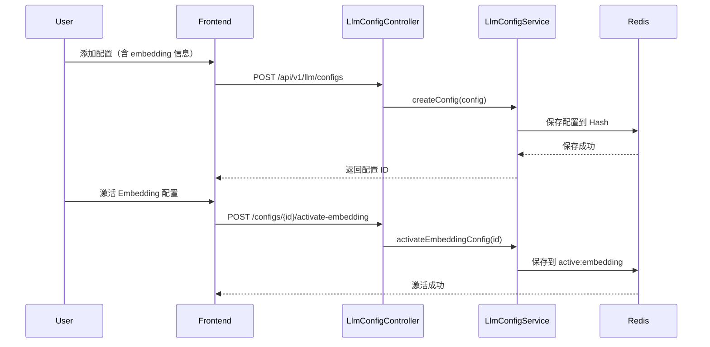
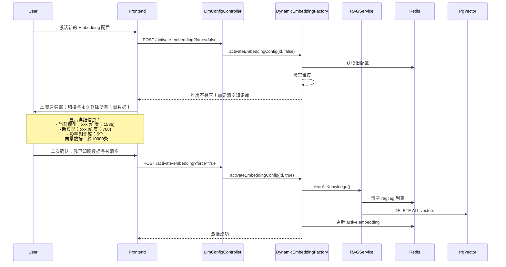

# 动态向量化配置技术规格文档

## 1. 需求概述

### 1.1 背景
当前项目已实现聊天模型的动态配置（API + Redis），但向量化模型仍依赖 YAML 静态配置。为提升系统灵活性和一致性，需要实现向量化模型的动态配置能力。

### 1.2 目标
- **目标 1**: 清理 YAML 中冗余的聊天模型配置（已被动态配置替代）
- **目标 2**: 实现向量化模型的 API 动态配置（方案 B：受控动态化）
- **目标 3**: 确保向量空间一致性，避免维度不兼容问题

### 1.3 核心约束
- ⚠️ **向量维度约束**: 不同模型生成的向量维度不同，切换模型后旧数据不可用
- ⚠️ **语义空间约束**: 即使维度相同，不同模型的向量空间语义不一致
- ✅ **解决方案**: 切换 embedding 配置时，强制清空所有知识库

---

## 2. 方案 B 详细设计

### 2.1 核心原则
1. **统一管理**: 聊天模型和向量化模型使用同一配置体系
2. **强制清空**: 切换 embedding 配置时必须清空知识库
3. **维度检测**: 记录每个配置的向量维度，切换时进行检查

### 2.2 数据结构设计

#### 扩展 `LlmProviderConfigDTO`

```java
@Data
@Builder
@NoArgsConstructor
@AllArgsConstructor
public class LlmProviderConfigDTO implements Serializable {
    
    // ========== 原有字段 ==========
    private String id;
    private String name;
    private String providerType;
    private String baseUrl;
    private String apiKey;
    private String defaultModel;
    private List<String> models;
    private boolean active;
    private LocalDateTime createdAt;
    private LocalDateTime updatedAt;
    
    // ========== 新增 Embedding 相关字段 ==========
    
    /**
     * Embedding 模型名称（可选）
     * 如果为空，表示该配置不支持 embedding
     */
    private String embeddingModel;
    
    /**
     * Embedding 向量维度（必填，如果 embeddingModel 不为空）
     * 用于检测向量空间兼容性
     * 
     * 常见维度：
     * - nomic-embed-text: 768
     * - text-embedding-ada-002: 1536
     * - text-embedding-3-small: 1536
     * - text-embedding-3-large: 3072
     */
    private Integer embeddingDimension;
    
    /**
     * 是否为激活的 Embedding 配置
     * 与 active 字段独立，因为聊天和 embedding 可以用不同配置
     */
    private boolean activeForEmbedding;
}
```

### 2.3 Redis 存储结构

```
# 原有存储（不变）
llm:provider:configs       # Hash<String, LlmProviderConfigDTO>
llm:provider:active        # String: 激活的聊天配置 ID

# 新增存储
llm:provider:active:embedding  # String: 激活的 Embedding 配置 ID
```

### 2.4 API 设计

#### 新增 API

##### 1. 激活 Embedding 配置
```http
POST /api/v1/llm/configs/{id}/activate-embedding
```

**请求参数**:
- `id`: 配置 ID
- `force`: 是否强制激活（清空知识库）

**响应**:
```json
{
  "code": "0000",
  "info": "激活成功",
  "data": {
    "requireClearKnowledge": true,
    "oldDimension": 1536,
    "newDimension": 768,
    "knowledgeCount": 5
  }
}
```

**业务逻辑**:
1. 检查目标配置是否支持 embedding（`embeddingModel` 不为空）
2. 获取当前激活的 embedding 配置（如果有）
3. 比较维度：
   - 维度相同 → 直接激活
   - 维度不同 → 返回提示，需要 `force=true` 才能激活
4. 如果 `force=true`，**清空所有知识库的向量数据**，然后激活

> [!WARNING]
> **数据清除警告**
> 
> 切换到不同维度的 Embedding 模型时，系统将**永久删除**以下数据：
> - 所有知识库的向量数据（存储在 PgVector 数据库中）
> - 所有知识库标签列表（存储在 Redis 中）
> 
> 此操作**不可逆**，请确保用户在前端明确确认后才执行。

##### 2. 获取激活的 Embedding 配置
```http
GET /api/v1/llm/configs/active-embedding
```

**响应**:
```json
{
  "code": "0000",
  "info": "查询成功",
  "data": {
    "id": "uuid-xxx",
    "name": "Ollama 本地",
    "providerType": "OLLAMA",
    "baseUrl": "http://127.0.0.1:11434",
    "embeddingModel": "nomic-embed-text",
    "embeddingDimension": 768,
    "activeForEmbedding": true
  }
}
```

#### 修改已有 API

##### 修改配置更新 API
```http
PUT /api/v1/llm/configs/{id}
```

新增字段验证：
- 如果 `embeddingModel` 不为空，`embeddingDimension` 必填
- 如果该配置已被激活为 embedding 配置，且维度变化，需要提示用户清空知识库

---

## 3. 核心组件设计

### 3.1 `DynamicEmbeddingFactory`

新建工厂类，管理动态 Embedding 模型的创建和切换。

```java
@Component
public class DynamicEmbeddingFactory {
    
    @Resource
    private RedissonClient redissonClient;
    
    @Resource
    private List<EmbeddingStrategy> strategies;
    
    // 缓存当前的 EmbeddingModel
    private volatile EmbeddingModel cachedEmbeddingModel;
    private volatile String activeConfigId;
    
    /**
     * 获取当前激活的 EmbeddingModel
     */
    public EmbeddingModel getActiveEmbeddingModel() {
        String configId = getActiveEmbeddingConfigId();
        if (configId == null) {
            throw new IllegalStateException("没有激活的 Embedding 配置");
        }
        
        // 如果配置没变，返回缓存
        if (configId.equals(activeConfigId) && cachedEmbeddingModel != null) {
            return cachedEmbeddingModel;
        }
        
        // 创建新的 EmbeddingModel
        LlmProviderConfigDTO config = getConfigById(configId);
        cachedEmbeddingModel = createEmbeddingModel(config);
        activeConfigId = configId;
        
        return cachedEmbeddingModel;
    }
    
    /**
     * 激活新的 Embedding 配置
     */
    public void activateEmbeddingConfig(String configId, boolean force) {
        LlmProviderConfigDTO newConfig = getConfigById(configId);
        String oldConfigId = getActiveEmbeddingConfigId();
        
        if (oldConfigId != null) {
            LlmProviderConfigDTO oldConfig = getConfigById(oldConfigId);
            
            // 检查维度是否兼容
            if (!newConfig.getEmbeddingDimension().equals(oldConfig.getEmbeddingDimension())) {
                if (!force) {
                    throw new DimensionMismatchException(
                        oldConfig.getEmbeddingDimension(),
                        newConfig.getEmbeddingDimension()
                    );
                }
                // 清空知识库
                clearAllKnowledge();
            }
        }
        
        // 保存激活配置
        RBucket<String> bucket = redissonClient.getBucket("llm:provider:active:embedding");
        bucket.set(configId);
        
        // 清除缓存
        cachedEmbeddingModel = null;
        activeConfigId = null;
    }
    
    private EmbeddingModel createEmbeddingModel(LlmProviderConfigDTO config) {
        return strategies.stream()
            .filter(s -> s.supports(config.getProviderType()))
            .findFirst()
            .orElseThrow()
            .createEmbeddingModel(config);
    }
    
    private void clearAllKnowledge() {
        // 调用 RAGDomainService 清空所有知识库
    }
}
```

### 3.2 `EmbeddingStrategy` 接口

```java
public interface EmbeddingStrategy {
    boolean supports(String providerType);
    EmbeddingModel createEmbeddingModel(LlmProviderConfigDTO config);
}
```

### 3.3 策略实现

#### `OllamaEmbeddingStrategy`
```java
@Component
public class OllamaEmbeddingStrategy implements EmbeddingStrategy {
    
    @Override
    public boolean supports(String providerType) {
        return "OLLAMA".equalsIgnoreCase(providerType);
    }
    
    @Override
    public EmbeddingModel createEmbeddingModel(LlmProviderConfigDTO config) {
        OllamaApi api = new OllamaApi(config.getBaseUrl());
        OllamaOptions options = OllamaOptions.builder()
            .model(config.getEmbeddingModel())
            .build();
        return OllamaEmbeddingModel.builder()
            .ollamaApi(api)
            .defaultOptions(options)
            .build();
    }
}
```

#### `OpenAiEmbeddingStrategy`
```java
@Component
public class OpenAiEmbeddingStrategy implements EmbeddingStrategy {
    
    @Override
    public boolean supports(String providerType) {
        return "OPENAI".equalsIgnoreCase(providerType) 
            || "GLM".equalsIgnoreCase(providerType);
    }
    
    @Override
    public EmbeddingModel createEmbeddingModel(LlmProviderConfigDTO config) {
        OpenAiApi api = new OpenAiApi(config.getBaseUrl(), config.getApiKey());
        return new OpenAiEmbeddingModel(api, 
            OpenAiEmbeddingOptions.builder()
                .model(config.getEmbeddingModel())
                .build()
        );
    }
}
```

### 3.4 修改 `AiConfig.java`

```java
@Configuration
public class AiConfig {
    
    @Resource
    private DynamicEmbeddingFactory embeddingFactory;
    
    /**
     * 创建 PgVectorStore（使用动态 Embedding）
     */
    @Bean
    public PgVectorStore pgVectorStore(JdbcTemplate jdbcTemplate) {
        // 使用 lazy initialization 延迟获取 EmbeddingModel
        return PgVectorStore.builder(jdbcTemplate, 
            new LazyEmbeddingModel(embeddingFactory)
        ).build();
    }
    
    @Bean
    public TokenTextSplitter tokenTextSplitter() {
        return new TokenTextSplitter();
    }
}
```

### 3.5 `LazyEmbeddingModel` 包装器

```java
public class LazyEmbeddingModel implements EmbeddingModel {
    
    private final DynamicEmbeddingFactory factory;
    
    public LazyEmbeddingModel(DynamicEmbeddingFactory factory) {
        this.factory = factory;
    }
    
    @Override
    public List<Double> embed(String text) {
        return factory.getActiveEmbeddingModel().embed(text);
    }
    
    @Override
    public List<List<Double>> embed(List<String> texts) {
        return factory.getActiveEmbeddingModel().embed(texts);
    }
    
    @Override
    public EmbeddingResponse call(EmbeddingRequest request) {
        return factory.getActiveEmbeddingModel().call(request);
    }
}
```

---

## 4. 业务流程

### 4.1 首次配置流程



### 4.2 切换配置流程（维度不同）



---

## 5. 风险与对策

| 风险 | 影响 | 对策 |
|------|------|------|
| 用户误操作切换配置导致数据丢失 | 🔴 极高 | 1. 前端明确显示**「永久删除所有向量数据」**警告<br/>2. 强制二次确认（输入确认文本或勾选复选框）<br/>3. 显示具体影响范围（模型对比、知识库数量、向量数量） |
| 维度检测逻辑错误 | 🟡 中 | 单元测试覆盖所有维度组合 |
| 清空知识库失败 | 🔴 高 | 事务处理，失败时回滚激活操作 |
| 缓存失效导致性能下降 | 🟢 低 | 合理的缓存策略 + 监控 |

---

## 6. 实施计划

### 阶段 1: 清理冗余配置（1-2 小时）
1. 清理 `application-dev.yml` 中冗余的 OpenAI 配置
2. 简化 `AiConfig.java`，移除 `openAiApi()` Bean
3. 验证应用启动成功

### 阶段 2: 扩展数据结构（2-3 小时）
1. 扩展 `LlmProviderConfigDTO`
2. 数据库迁移（如果有持久化需求）
3. 前端表单支持新字段

### 阶段 3: 实现动态 Embedding（4-6 小时）
1. 创建 `DynamicEmbeddingFactory`
2. 实现 `EmbeddingStrategy` 及各策略类
3. 实现 `LazyEmbeddingModel`
4. 修改 `AiConfig.java`

### 阶段 4: API 开发（3-4 小时）
1. 新增 `activateEmbeddingConfig` 接口
2. 新增 `getActiveEmbeddingConfig` 接口
3. 实现清空知识库逻辑
4. 异常处理和参数验证

### 阶段 5: 前端集成（2-3 小时）
1. 配置表单支持 embedding 字段
2. 激活 embedding 按钮和确认弹窗
3. **切换提示和二次确认**（重点）
   - 显示当前模型和新模型的对比信息
   - 显示向量维度变化
   - 显示将被清空的知识库数量
   - 明确提示：**「所有向量数据将被永久删除」**
   - 要求用户输入确认文本或勾选"我已知晓"复选框

### 阶段 6: 测试验证（2-3 小时）
1. 单元测试
2. 集成测试
3. 端到端测试

**总计**: 14-21 小时

---

## 7. 成功标准

- ✅ 应用启动时无 YAML 中的 OpenAI 配置
- ✅ 可通过 API 添加支持 embedding 的配置
- ✅ 可通过 API 激活 embedding 配置
- ✅ 切换不同维度的配置时，系统提示清空知识库
- ✅ 强制切换后，所有知识库被正确清空
- ✅ 上传文档使用动态配置的 embedding 模型
- ✅ RAG 检索功能正常工作
